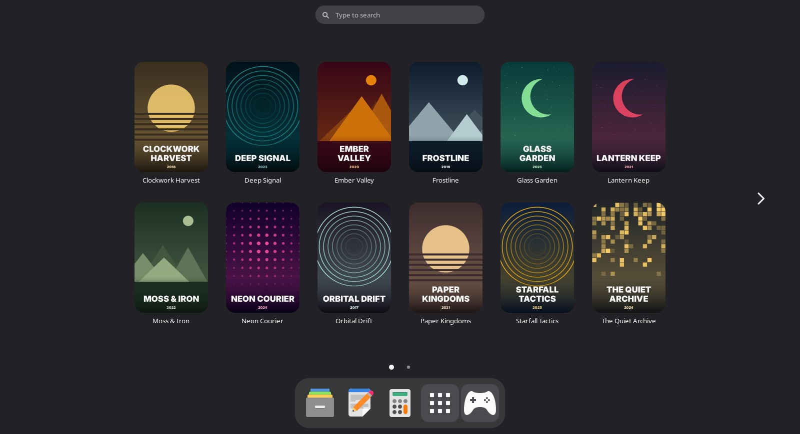
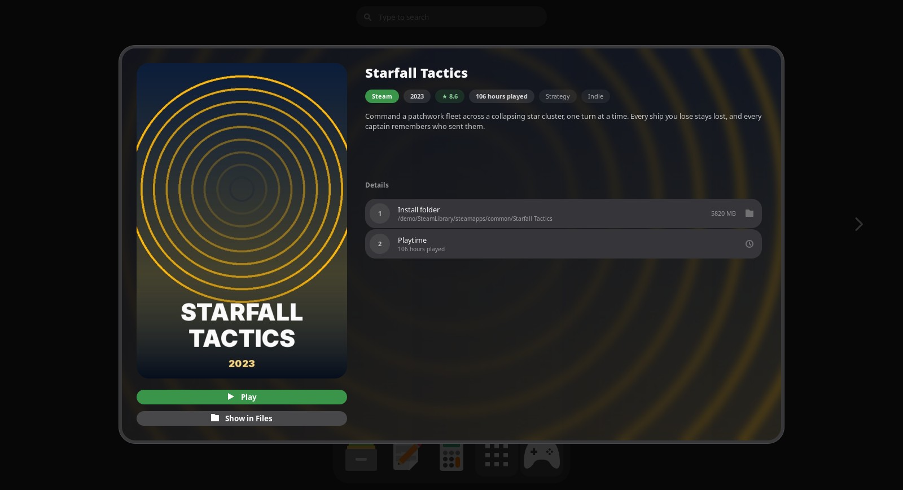
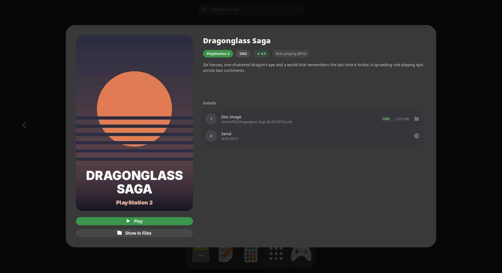
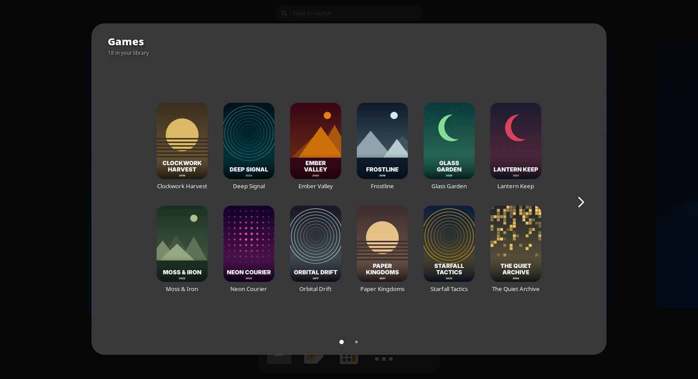
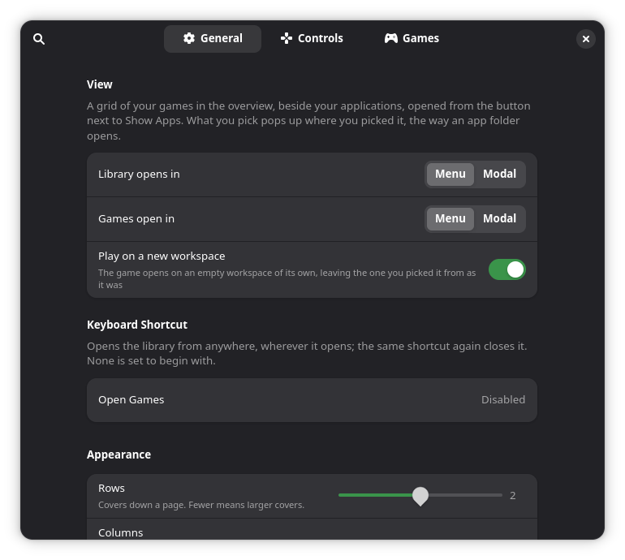
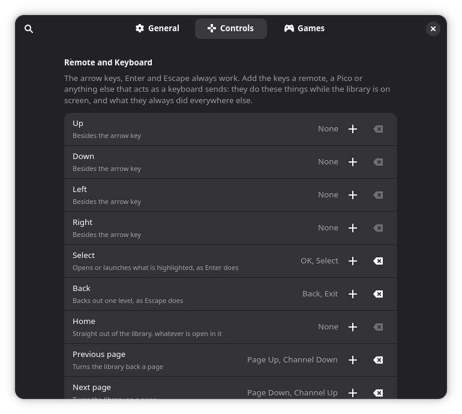
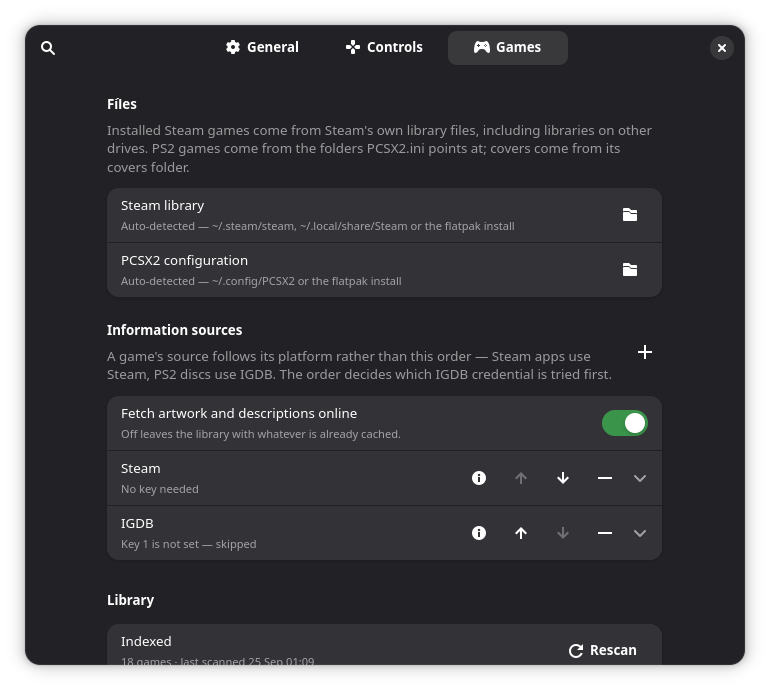

<div align="center">

# Games Menu

**Your installed games, in a menu of their own beside Show Apps.**

Every Steam game on every drive, and the PS2 discs PCSX2 knows about, in one
library with proper cover art.<br>
It opens in the overview next to your apps, and **Play** starts the game the
way its launcher would.



<sub>The library in the overview, opened from the **Games** button beside Show Apps.</sub>

</div>

**It does not run games itself.** There is no emulator or launcher in here. A
Steam game is started through Steam (`steam://rungameid/…`, so your launch
options, Proton version and overlay all still apply), and a PS2 disc is handed
to PCSX2. Think of it as a good-looking front door to launchers you already
use.

## What it does

- **Finds your games on its own.** Steam's own library files are read,
  including libraries on other drives, and PS2 discs come from wherever
  `PCSX2.ini` points. Nothing to configure.
- **Finds the artwork for you.** Steam games get Valve's own library art and
  store description; PS2 discs use PCSX2's covers, or IGDB's with a free key.
  Everything is cached locally and pre-scaled, so browsing stays instant.
- **Built out of GNOME, not on top of it.** The grid *is* the shell's app grid
  — same paging, same swipe, same keyboard, same hover and focus rings — and a
  game opens the way an app folder does. It follows your accent colour, your
  font size and your theme, because it uses the shell's own widgets rather
  than imitating them.
- **Made for the couch.** A game controller, a media remote, or any keys you
  choose can drive it, and the Guide button opens it from the desktop.
- **Nothing to leave running.** No daemon, no tray icon, no window. It draws
  when you look at it and costs nothing when you don't.

It is not a launcher, an emulator or a store; it won't install, move or
uninstall anything; and the only things it downloads are artwork and
descriptions.

## A game

Pick a cover and it zooms out into a panel, the way an app folder opens: the
artwork, **Play** and **Show in Files** on one side; the platform, year,
rating, playtime, genres, description and where it lives on the other.

<table>
  <tr>
    <td width="50%"></td>
    <td width="50%"></td>
  </tr>
  <tr>
    <td valign="top"><b>Steam</b>: Valve's own art and store description, and
    the playtime Steam has recorded.</td>
    <td valign="top"><b>PlayStation 2</b>: PCSX2's cover or IGDB's, the disc
    image and its serial.</td>
  </tr>
</table>

## Or as a panel



Set **Library opens in** to **Modal** and the Games button pops the library out
as a panel instead, exactly as an app folder pops out of its icon. Where a
picked game opens is a separate setting, so any mix of the two works:

| | Library opens in | Games open in |
|---|---|---|
| **Menu** | The overview, next to your apps | A pop-up that zooms out of the cover, the way an app folder does |
| **Modal** | A panel that pops out of the Games button | A pop-up over everything, until you dismiss it |

**Play on a new workspace** (on by default) starts each game on an empty
workspace of its own, leaving the one you picked it from as it was.

## Preferences

<table>
  <tr>
    <td width="33%"></td>
    <td width="33%"></td>
    <td width="33%"></td>
  </tr>
  <tr>
    <td valign="top"><b>General</b>: where things open, a keyboard shortcut,
    and the look — rows, columns, corner radius, pop-up size.</td>
    <td valign="top"><b>Controls</b>: remote keys and controller buttons for
    each action.</td>
    <td valign="top"><b>Games</b>: where Steam and PCSX2 are, where artwork
    comes from, and Rescan.</td>
  </tr>
</table>

Colour comes from your system accent, and text sizes follow Settings →
Accessibility → Large Text.

## Install

It isn't on extensions.gnome.org yet, so install it from source. You need GNOME
Shell 48, 49 or 50, `make`, and Python 3 for the scanner. Nothing else: the
scanner uses the image libraries GNOME already ships, or
[Pillow](https://python-pillow.org/) if you have it.

```bash
git clone https://github.com/Jackicus/Gnome-Extension-Games-Menu.git
cd Gnome-Extension-Games-Menu
make install
```

GNOME Shell only looks for new extensions when you log in. Log out, log back
in, then turn it on:

```bash
gnome-extensions enable games-menu@jackt
```

Then open the preferences (`gnome-extensions prefs games-menu@jackt`) and press
**Rescan** on the **Games** page. The first scan takes a while, since it looks
every game up online; after that it only fetches what it hasn't seen. A
**Games** button appears beside Show Apps — in the overview's dash, or in Dash
to Panel's panel if you use it.

To update, run `git pull && make install`, then log out and back in. To remove
it, run `make uninstall`.

> [!NOTE]
> It has been run on GNOME Shell 50. 48 and 49 are claimed from reading the
> shell's own sources, not from running them. See
> [docs/compatibility.md](docs/compatibility.md).

## Artwork sources

| Games | Source | Key needed? |
|---|---|---|
| Steam | Steam's store and artwork CDN | No |
| PlayStation 2 | PCSX2's own covers, then IGDB | Only for IGDB |

IGDB needs a free Twitch developer application —
[dev.twitch.tv](https://dev.twitch.tv/console/apps) → Applications → Register —
whose client ID and secret go on the Games page. Without one, a PS2 disc with no
PCSX2 cover gets a drawn placeholder.

> [!IMPORTANT]
> Keys are stored in dconf in plain text, like any other GNOME setting. Treat
> them the way you'd treat any other credential on your machine.

## Controllers and remotes

The **Controls** page binds each action — the four directions, Select, Back,
Home and a page each way — to keys and to controller buttons. Xbox,
PlayStation and most other pads work as they are, and the Guide button opens
the library whenever no window has the keyboard. Controllers are only listened
to while the library is on screen, so your games are left alone. It uses
libmanette, which most GNOME desktops already have.

## Alongside other extensions

Games Menu keeps to its own button, settings and cache, so it sits happily
beside docks, Dash to Panel, Blur my Shell, and other extensions that put a
button beside Show Apps. If another extension's grid is up in the overview when
you press **Games**, the overview closes and reopens on your games rather than
drawing one grid over the other. On a controller, Guide opens Games Menu and
Menu is left free for anything else.

## Troubleshooting

| Command | Does |
|---|---|
| `make status` | What's installed, whether it's enabled, how big the library is |
| `make scan` | Re-index your games and fetch artwork, as Rescan does |
| `make logs` | Follow the shell journal, filtered to this extension |

Something looks wrong? `make logs` first — a GNOME extension's errors go to the
system journal, never to a terminal.

## Development

```bash
make link      # install as a link to src/, so edits are live
make reload    # apply your edits to the running shell, no logout needed
make nested    # start a throwaway nested GNOME Shell, mirrored in a window
make pack      # build dist/games-menu@jackt.shell-extension.zip
```

Edits to `extension.js` or `metadata.json` still need a log out and back in.
`CLAUDE.md` is the design document: how the pieces fit together, which shell
internals are used and why, and the traps that bite. [`docs/`](docs/) covers
the private API the extension depends on, compatibility, and publishing.

The screenshots are of a made-up library (`scripts/demo_library.py`): the games
and their artwork are invented, drawn by that script, and taken in a nested
shell with `./scripts/nested.sh start --clean --demo`.

---

<sub>Steam is a trademark of Valve Corporation, and PlayStation of Sony
Interactive Entertainment. This project is not affiliated with either, nor with
PCSX2 or IGDB.</sub>
